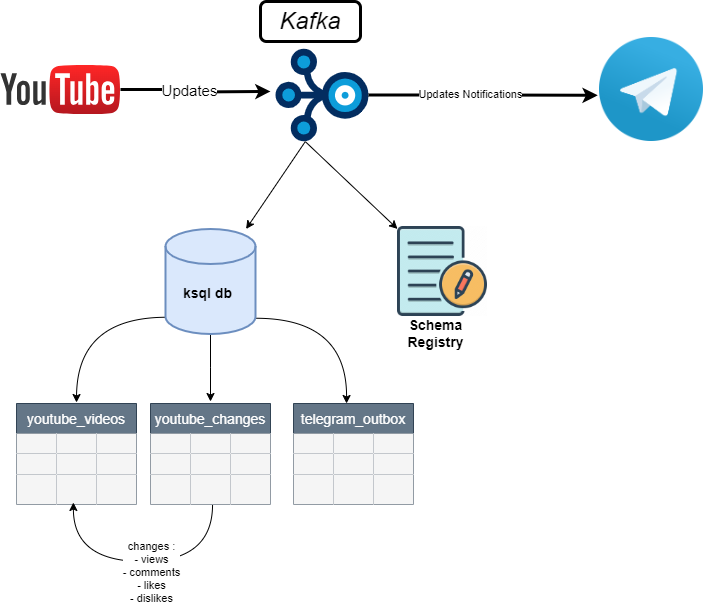

# KafkaTube - Real-time Updates for Favorite YouTube Playlists with Kafka

## Introduction

KafkaTube is a project that allows you to receive real-time updates for videos in your favorite YouTube playlist using Kafka on your Telegram API. By integrating with the YouTube Data API, Kafka and Telegram API, KafkaTube fetches playlist items from YouTube, tracks changes in video likes, comments, and views. Whenever a change is detected, a notification is sent to a specified Telegram chat or channel.

## Prerequisites

Before running the project, make sure you have the following requirements installed:

- Python 3.x
- `pip` package manager
- [Telegram bot API](https://core.telegram.org/bots/api)

## Architecture

## Installation

1. Clone the project repository:
    `git clone https://github.com/DavidAbdelmalek/data_engineering_etl_projects.git`
2. Navigate to the project directory:

    `cd  youtube_watcher`

3. Install the required packages:
    `pip install -r requirements.txt`

## Set up the configuration:

1. Create a `config.py` file in the project directory.
2. Define the following variables in the `config.py` file:
   - `config`: Dictionary containing the configuration parameters.
     - `schema_registry`: URL of the Schema Registry and required credentials.
     - `kafka`: Dictionary containing Kafka configuration parameters.
     - `youtube_api_key`: Your YouTube Data API key.
     - `youtube_playlist_id`: ID of the YouTube playlist to analyze.
3. Update the `<your chat id>` placeholders in the code with the actual chat ID for the Telegram channel or user where you want to send the notifications.

4. Create the necessary streams and tables:

   - Copy and run the provided SQL statements in the ksqlDB CLI to create the `youtube_videos` stream, `youtube_changes` table, and `youtube_changes_stream` stream.

## Credits

This project is inspired by the [Kris Jenkins Coding In Motion](https://github.com/confluentinc/coding-in-motion/tree/main/watching-the-river-flow).

## License

This project is licensed under the [MIT License](https://file+.vscode-resource.vscode-cdn.net/c%3A/Users/dabdelma/.vscode/extensions/codeium.codeium-1.2.101/dist/LICENSE).
